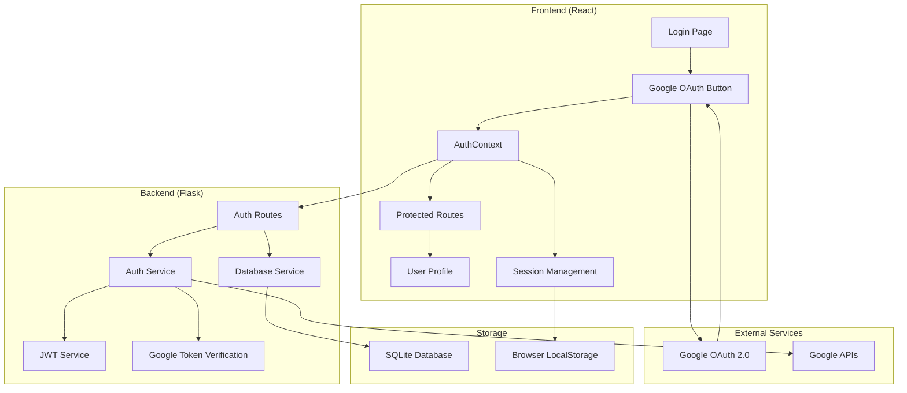
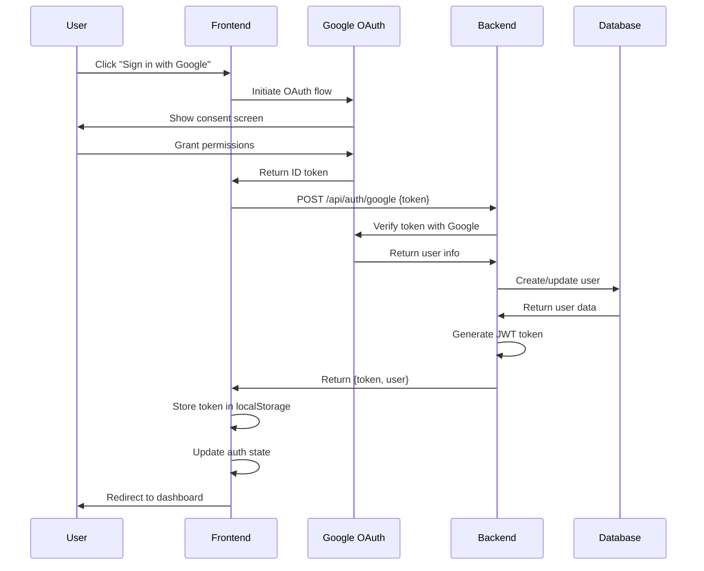

# Design Document

## Overview

The Google OAuth Authentication Enhancement builds upon the existing authentication infrastructure in the TTSAI application. The system implements a secure, user-friendly authentication flow using Google Sign-In OAuth 2.0, with comprehensive session management, token handling, and user profile management. The design leverages the existing backend authentication service and enhances the frontend components for a seamless user experience.

## Architecture

### High-Level Architecture



### Authentication Flow



## Components and Interfaces

### Frontend Components

#### 1. AuthContext (Enhanced)
- **Purpose**: Centralized authentication state management
- **Key Features**:
  - JWT token management with automatic refresh
  - User state persistence across sessions
  - Error handling and loading states
  - Automatic token expiration checking

#### 2. GoogleSignInButton (Enhanced)
- **Purpose**: Google OAuth integration component
- **Key Features**:
  - Customizable appearance and behavior
  - Loading states and error handling
  - Success/error callbacks
  - Accessibility compliance

#### 3. ProtectedRoute (Enhanced)
- **Purpose**: Route-level authentication guard
- **Key Features**:
  - Flexible authentication requirements
  - Custom loading and fallback components
  - Redirect handling with state preservation

#### 4. AuthGuard (Enhanced)
- **Purpose**: Component-level authentication wrapper
- **Key Features**:
  - Inline authentication prompts
  - Customizable UI components
  - Graceful degradation for unauthenticated users

#### 5. UserProfile (New)
- **Purpose**: User profile display and management
- **Key Features**:
  - Profile information display
  - Profile picture handling
  - Account settings integration

#### 6. SessionTimeoutWarning (Enhanced)
- **Purpose**: Session expiration management
- **Key Features**:
  - Proactive session renewal
  - User-friendly timeout warnings
  - Automatic logout on expiration

### Backend Components

#### 1. AuthService (Enhanced)
- **Purpose**: Core authentication business logic
- **Key Features**:
  - Google token verification
  - JWT token generation and validation
  - User creation and updates
  - Token refresh mechanisms

#### 2. AuthRoutes (Enhanced)
- **Purpose**: Authentication API endpoints
- **Key Features**:
  - RESTful authentication endpoints
  - Comprehensive error handling
  - Request validation and sanitization
  - Rate limiting and security measures

#### 3. Database Service (Enhanced)
- **Purpose**: User data persistence
- **Key Features**:
  - User CRUD operations
  - Session management
  - Data integrity and validation
  - Migration support

## Data Models

### User Model
```python
class User:
    id: str (UUID)
    google_id: str (unique)
    name: str
    email: str (unique)
    profile_picture: str (URL)
    created_at: datetime
    updated_at: datetime
    last_login: datetime
    preferences: dict (JSON)
    is_active: bool
```

### Session Model
```python
class UserSession:
    id: str (UUID)
    user_id: str (foreign key)
    token_hash: str
    created_at: datetime
    expires_at: datetime
    last_accessed: datetime
    device_info: dict (JSON)
    is_active: bool
```

### JWT Token Payload
```javascript
{
  sub: string,        // User ID
  name: string,       // User name
  email: string,      // User email
  iat: number,        // Issued at
  exp: number,        // Expiration time
  aud: string,        // Audience
  iss: string         // Issuer
}
```

## Error Handling

### Frontend Error Handling

#### 1. Authentication Errors
- **Network Errors**: Retry mechanisms with exponential backoff
- **Token Errors**: Automatic token refresh or re-authentication
- **Google OAuth Errors**: User-friendly error messages with retry options

#### 2. Session Errors
- **Expired Sessions**: Automatic refresh or graceful logout
- **Invalid Tokens**: Clear storage and redirect to login
- **Network Timeouts**: Offline mode indicators and retry options

### Backend Error Handling

#### 1. API Error Responses
```python
{
  "error": "error_code",
  "message": "User-friendly error message",
  "details": "Technical details for debugging",
  "timestamp": "ISO 8601 timestamp",
  "request_id": "unique_request_identifier"
}
```

#### 2. Error Categories
- **400 Bad Request**: Invalid request data or missing parameters
- **401 Unauthorized**: Invalid or expired authentication tokens
- **403 Forbidden**: Insufficient permissions for requested resource
- **429 Too Many Requests**: Rate limiting exceeded
- **500 Internal Server Error**: Server-side errors with logging

## Testing Strategy

### Frontend Testing

#### 1. Unit Tests
- **AuthContext**: State management and action dispatching
- **GoogleSignInButton**: User interactions and callback handling
- **ProtectedRoute**: Route protection logic
- **AuthGuard**: Component rendering based on auth state

#### 2. Integration Tests
- **Authentication Flow**: Complete login/logout process
- **Token Management**: Token storage, refresh, and expiration
- **Route Protection**: Navigation and access control
- **Error Scenarios**: Network failures and invalid responses

#### 3. E2E Tests
- **User Journey**: Complete authentication workflow
- **Cross-Browser**: Compatibility across different browsers
- **Mobile Responsive**: Touch interactions and responsive design

### Backend Testing

#### 1. Unit Tests
- **AuthService**: Token verification and user management
- **AuthRoutes**: Endpoint functionality and validation
- **Database Operations**: CRUD operations and data integrity

#### 2. Integration Tests
- **Google OAuth**: Token verification with Google APIs
- **Database Integration**: User creation and session management
- **JWT Operations**: Token generation, validation, and refresh

#### 3. Security Tests
- **Token Security**: JWT signature validation and expiration
- **Input Validation**: SQL injection and XSS prevention
- **Rate Limiting**: API abuse prevention
- **CORS Configuration**: Cross-origin request handling

## Security Considerations

### 1. Token Security
- **JWT Signing**: Strong secret keys with regular rotation
- **Token Expiration**: Short-lived tokens with refresh mechanisms
- **Secure Storage**: HTTP-only cookies or secure localStorage
- **Token Validation**: Server-side signature verification

### 2. Google OAuth Security
- **Client ID Validation**: Verify tokens are for correct application
- **Scope Limitation**: Request minimal required permissions
- **Token Verification**: Server-side verification with Google APIs
- **CSRF Protection**: State parameter validation

### 3. Session Management
- **Session Timeout**: Automatic logout after inactivity
- **Concurrent Sessions**: Limit active sessions per user
- **Session Invalidation**: Proper cleanup on logout
- **Device Tracking**: Monitor and manage user devices

### 4. Data Protection
- **HTTPS Enforcement**: All authentication traffic over HTTPS
- **Input Sanitization**: Prevent injection attacks
- **Error Information**: Limit sensitive data in error messages
- **Audit Logging**: Track authentication events

## Performance Considerations

### 1. Frontend Performance
- **Code Splitting**: Lazy load authentication components
- **Token Caching**: Efficient token storage and retrieval
- **State Management**: Optimized context updates
- **Bundle Size**: Minimize authentication library impact

### 2. Backend Performance
- **Token Validation**: Efficient JWT verification
- **Database Queries**: Optimized user lookups
- **Caching**: Redis for session and user data
- **Rate Limiting**: Protect against abuse

### 3. Network Optimization
- **Request Batching**: Combine related API calls
- **Compression**: Gzip response compression
- **CDN Integration**: Static asset delivery
- **Connection Pooling**: Efficient database connections

## Deployment Considerations

### 1. Environment Configuration
- **Development**: Local OAuth credentials and database
- **Staging**: Production-like environment for testing
- **Production**: Secure credentials and monitoring

### 2. Security Configuration
- **CORS Settings**: Restrict to authorized domains
- **SSL Certificates**: Valid certificates for HTTPS
- **Environment Variables**: Secure credential management
- **Firewall Rules**: Restrict database access

### 3. Monitoring and Logging
- **Authentication Metrics**: Login success/failure rates
- **Performance Monitoring**: Response times and errors
- **Security Alerts**: Suspicious authentication attempts
- **User Analytics**: Authentication patterns and usage