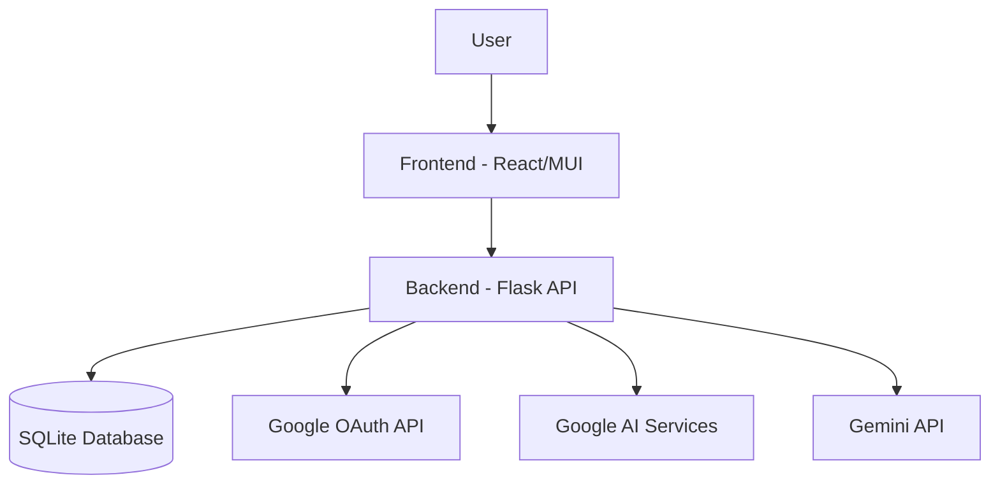
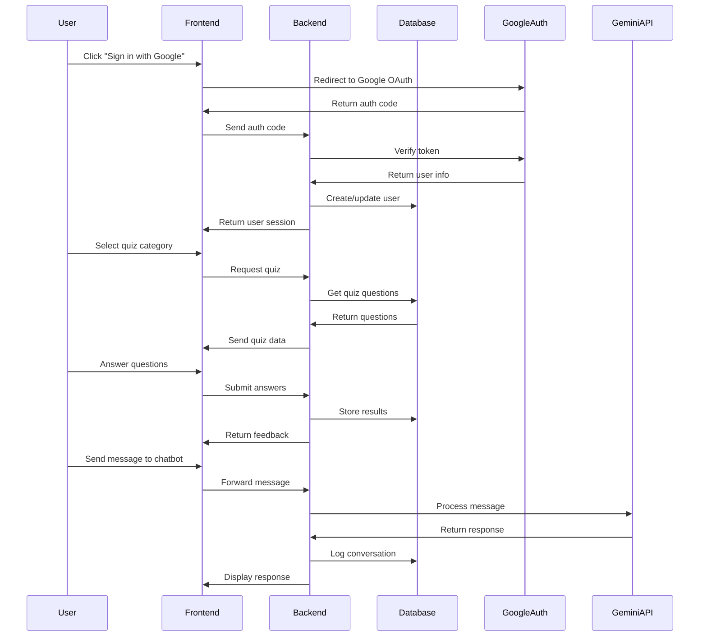
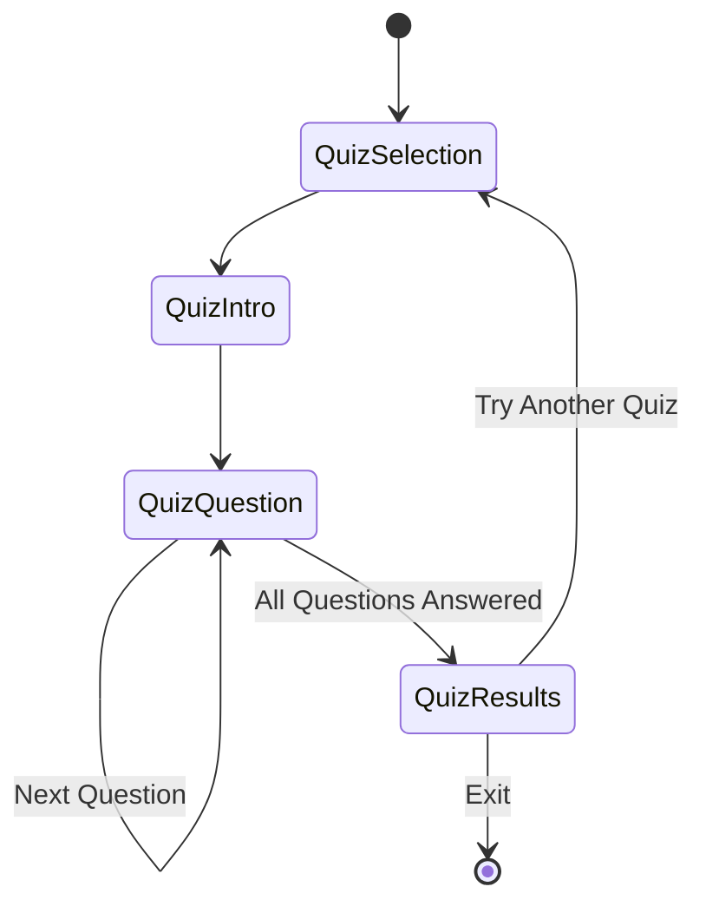
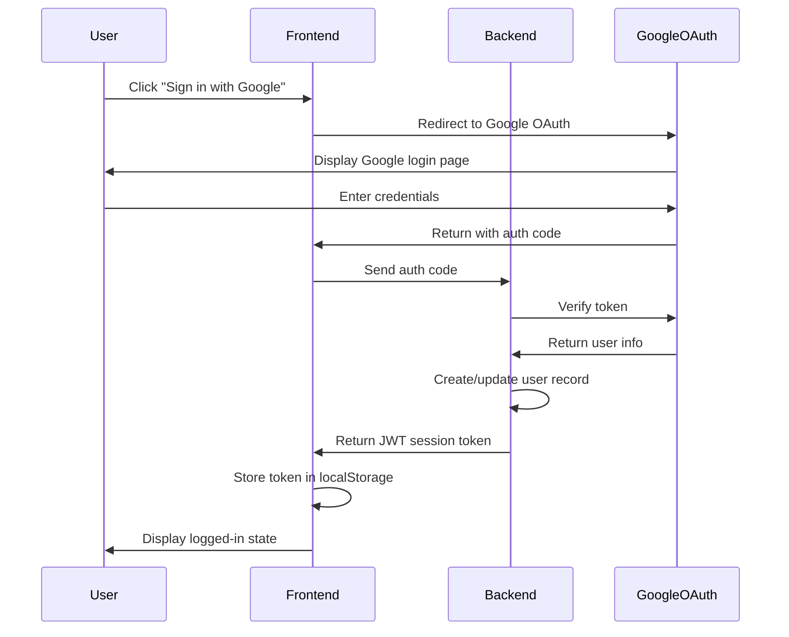

# Design Document: Learning Tools Revamp

## Overview

This design document outlines the architecture and implementation details for revamping the learning tools page of the application. The revamp includes three major components:

1. **Learning Tools Page Redesign**: A modern, card-based interface that organizes learning tools in a clear, visually appealing layout.
2. **Quiz Feature Implementation**: A new quiz system that allows users to test their knowledge and track progress.
3. **Google Authentication Integration**: Implementation of Google OAuth for user authentication.
4. **Simplified Avatar Chatbot**: A streamlined chatbot interface with a single text input box.

The design aims to create a cohesive learning experience where all components work together to enhance language learning.

## Architecture

### System Architecture

The application follows a client-server architecture:

- **Frontend**: React application with Material-UI components
- **Backend**: Flask API server with Google AI services integration
- **Database**: SQLite database for storing user data, quiz information, and learning progress



### Data Flow



## Components and Interfaces

### 1. Learning Tools Page Redesign

#### UI Components

- **ToolsContainer**: Main container for the learning tools page
- **ToolCard**: Reusable card component for each learning tool
- **ToolsNavigation**: Navigation component for switching between tool categories
- **ProgressSummary**: Component displaying user's overall learning progress

#### Layout Design

The learning tools page will use a responsive grid layout with cards:

```
+-----------------------------------------------+
| User Profile | Progress Summary | Settings    |
+-----------------------------------------------+
| Tools Navigation                              |
+-----------------------------------------------+
| +----------+  +----------+  +----------+      |
| | Tool 1   |  | Tool 2   |  | Tool 3   |      |
| | [Icon]   |  | [Icon]   |  | [Icon]   |      |
| | Desc...  |  | Desc...  |  | Desc...  |      |
| +----------+  +----------+  +----------+      |
|                                               |
| +----------+  +----------+  +----------+      |
| | Tool 4   |  | Tool 5   |  | Tool 6   |      |
| | [Icon]   |  | [Icon]   |  | [Icon]   |      |
| | Desc...  |  | Desc...  |  | Desc...  |      |
| +----------+  +----------+  +----------+      |
+-----------------------------------------------+
```

#### Interactions

- Hover effects with subtle elevation changes
- Click animations for tool selection
- Smooth transitions between tool categories
- Progress indicators for completed activities

### 2. Quiz Feature Implementation

#### Data Models

**Quiz Model**:
```json
{
  "id": "string",
  "title": "string",
  "description": "string",
  "language": "string",
  "difficulty": "string",
  "category": "string",
  "questions": [
    {
      "id": "string",
      "type": "multiple_choice|true_false|fill_blank|matching",
      "prompt": "string",
      "options": ["string"],
      "correctAnswer": "string|number|array",
      "explanation": "string",
      "points": "number"
    }
  ],
  "totalPoints": "number",
  "timeLimit": "number|null",
  "created": "timestamp",
  "updated": "timestamp"
}
```

**QuizAttempt Model**:
```json
{
  "id": "string",
  "userId": "string",
  "quizId": "string",
  "startTime": "timestamp",
  "endTime": "timestamp|null",
  "answers": [
    {
      "questionId": "string",
      "userAnswer": "string|number|array",
      "isCorrect": "boolean",
      "pointsEarned": "number"
    }
  ],
  "score": "number",
  "completed": "boolean",
  "totalTime": "number|null"
}
```

#### API Endpoints

- `GET /api/quizzes`: Get available quizzes (filtered by language, category, difficulty)
- `GET /api/quiz/{id}`: Get a specific quiz
- `POST /api/quiz/attempt/start`: Start a quiz attempt
- `POST /api/quiz/attempt/{id}/submit`: Submit a quiz answer
- `POST /api/quiz/attempt/{id}/complete`: Complete a quiz attempt
- `GET /api/user/quiz-history`: Get user's quiz history

#### Quiz Flow



### 3. Google Authentication Integration

#### Authentication Flow



#### User Model Extension

```json
{
  "id": "string",
  "email": "string",
  "name": "string",
  "googleId": "string",
  "profilePicture": "string",
  "lastLogin": "timestamp",
  "createdAt": "timestamp",
  "updatedAt": "timestamp",
  "preferences": {
    "language": "string",
    "theme": "string",
    "notifications": "boolean"
  }
}
```

#### API Endpoints

- `POST /api/auth/google`: Process Google authentication
- `GET /api/auth/user`: Get current user information
- `POST /api/auth/logout`: Log out user
- `GET /api/auth/session`: Validate session

### 4. Simplified Avatar Chatbot

#### UI Components

- **ChatContainer**: Main container for the chat interface
- **MessageList**: Component to display conversation history
- **MessageInput**: Simple text input component
- **AvatarDisplay**: Component to display the avatar's image/emoji
- **TopicSelector**: Optional component for selecting conversation topics

#### Chatbot Interface

```
+-----------------------------------------------+
| Avatar Chat                                   |
+-----------------------------------------------+
| [Topic Selector]                              |
+-----------------------------------------------+
|                                               |
| [Avatar] Hello! How can I help you today?     |
|                                               |
| How do I say "thank you" in Spanish?     [Me] |
|                                               |
| [Avatar] "Thank you" in Spanish is "Gracias"  |
| Here's how to pronounce it: [gra-see-as]      |
|                                               |
|                                               |
|                                               |
+-----------------------------------------------+
| Type your message...              [Send] [Mic]|
+-----------------------------------------------+
```

#### Conversation Model

```json
{
  "sessionId": "string",
  "userId": "string",
  "avatarId": "string",
  "language": "string",
  "messages": [
    {
      "id": "string",
      "sender": "user|avatar",
      "text": "string",
      "timestamp": "timestamp",
      "metadata": {
        "vocabulary": ["string"],
        "grammarNotes": "string",
        "culturalNotes": "string",
        "emotion": "string"
      }
    }
  ],
  "created": "timestamp",
  "updated": "timestamp",
  "topic": "string|null"
}
```

#### API Endpoints

- `POST /api/conversation/start`: Start a new conversation
- `POST /api/conversation/message`: Send a message to the avatar
- `GET /api/conversation/history`: Get conversation history
- `GET /api/conversation/topics`: Get available conversation topics

## Data Models

### Core Data Models

#### User
```json
{
  "id": "string",
  "email": "string",
  "name": "string",
  "googleId": "string",
  "profilePicture": "string",
  "createdAt": "timestamp",
  "updatedAt": "timestamp",
  "lastLogin": "timestamp"
}
```

#### LearningProgress
```json
{
  "userId": "string",
  "language": "string",
  "xpPoints": "number",
  "level": "number",
  "wordsLearned": "number",
  "quizzesCompleted": "number",
  "conversationMinutes": "number",
  "streakDays": "number",
  "lastActivity": "timestamp",
  "achievements": ["string"]
}
```

#### UserPreferences
```json
{
  "userId": "string",
  "interfaceLanguage": "string",
  "learningLanguages": ["string"],
  "difficulty": "string",
  "dailyGoal": "number",
  "theme": "string",
  "notifications": "boolean"
}
```

## Error Handling

### Frontend Error Handling

- Form validation with clear error messages
- Network error detection with retry options
- Fallback UI components for failed data loading
- Comprehensive error boundaries for React components

### Backend Error Handling

- Structured error responses with appropriate HTTP status codes
- Detailed logging for debugging
- Rate limiting to prevent abuse
- Graceful degradation when external services are unavailable

## Testing Strategy

### Frontend Testing

- **Unit Tests**: Test individual components using React Testing Library
- **Integration Tests**: Test component interactions
- **E2E Tests**: Test complete user flows using Cypress

### Backend Testing

- **Unit Tests**: Test individual functions and utilities
- **API Tests**: Test API endpoints with various inputs
- **Integration Tests**: Test database interactions and external service integrations

### Test Cases

1. **Learning Tools Page**
   - Verify all tools are displayed correctly
   - Test responsive layout on different screen sizes
   - Verify tool card interactions (hover, click)

2. **Quiz Feature**
   - Test quiz selection and filtering
   - Verify question rendering for different question types
   - Test answer submission and scoring
   - Verify results display and feedback

3. **Google Authentication**
   - Test sign-in flow
   - Verify user data storage
   - Test session management
   - Verify logout functionality

4. **Avatar Chatbot**
   - Test message sending and receiving
   - Verify conversation history display
   - Test topic selection
   - Verify error handling for failed responses

## Security Considerations

1. **Authentication Security**
   - Use OAuth 2.0 best practices
   - Implement proper token validation
   - Use HTTPS for all communications
   - Store tokens securely (HTTP-only cookies or secure storage)

2. **Data Protection**
   - Sanitize user inputs to prevent injection attacks
   - Implement proper access controls
   - Encrypt sensitive data
   - Implement rate limiting to prevent abuse

3. **API Security**
   - Validate all inputs
   - Use proper authentication for all endpoints
   - Implement CORS policies
   - Use appropriate HTTP methods and status codes

## Implementation Plan

The implementation will follow a phased approach:

1. **Phase 1**: Learning Tools Page Redesign
2. **Phase 2**: Google Authentication Integration
3. **Phase 3**: Quiz Feature Implementation
4. **Phase 4**: Simplified Avatar Chatbot
5. **Phase 5**: Cross-Feature Integration and Testing

Each phase will include:
- Component development
- API implementation
- Testing
- Integration with existing features