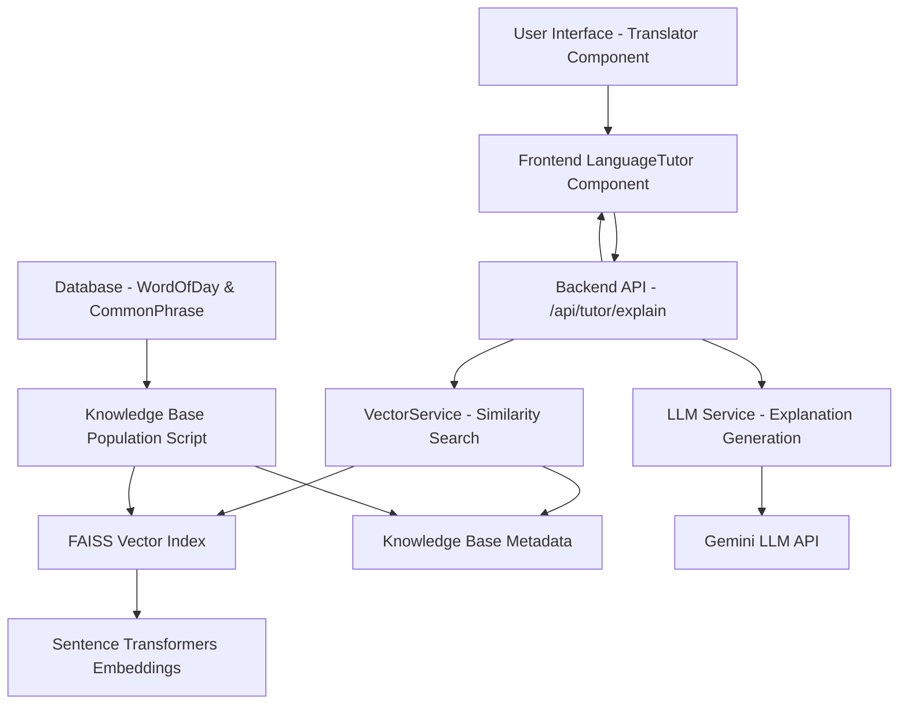

# Design Document: RAG-based Language Learning Tutor

## Overview

The RAG-based Language Learning Tutor enhances the existing language learning application by providing contextually-aware, detailed explanations for translated words and phrases. The system combines Retrieval-Augmented Generation (RAG) architecture with the existing Gemini LLM integration to deliver comprehensive learning insights.

The feature leverages the application's existing knowledge base (Word of the Day entries and Common Phrases) to provide relevant context that augments the LLM's general knowledge, resulting in more accurate and pedagogically valuable explanations.

## Architecture

### High-Level Architecture



### Data Flow

1. **User Interaction**: User clicks "Explain" button on translated text
2. **Query Processing**: Frontend sends explanation request to backend API
3. **Context Retrieval**: VectorService performs similarity search on knowledge base
4. **Context Augmentation**: Retrieved documents are formatted and added to LLM prompt
5. **Explanation Generation**: Enhanced prompt is sent to Gemini LLM
6. **Response Processing**: LLM response is parsed and validated
7. **UI Display**: Structured explanation is displayed in the frontend component

## Components and Interfaces

### Backend Components

#### 1. VectorService Class (`backend/vector_service.py`)

**Purpose**: Manages vector embeddings, FAISS index operations, and similarity searches.

**Key Methods**:
- `__init__()`: Initialize sentence transformer model
- `load_index()`: Load pre-built FAISS index and metadata from disk
- `search(query_text: str, k: int = 5)`: Perform similarity search and return relevant documents

**Dependencies**:
- `sentence-transformers`: For text embeddings using 'all-MiniLM-L6-v2' model
- `faiss-cpu`: For efficient vector similarity search
- `json`: For metadata serialization

**Configuration**:
```python
MODEL_NAME = 'all-MiniLM-L6-v2'  # Lightweight, multilingual model
INDEX_FILE = 'learning_kb.index'  # FAISS index file
METADATA_FILE = 'learning_kb_meta.json'  # Document metadata
DATA_DIR = 'data'  # Storage directory
```

#### 2. Knowledge Base Population Script (`populate_kb.py`)

**Purpose**: Processes existing database content into vector embeddings and builds FAISS index.

**Process Flow**:
1. Query WordOfDay and CommonPhrase tables
2. Extract text content (examples, cultural notes, phrases)
3. Generate embeddings using sentence transformers
4. Create and populate FAISS index with cosine similarity
5. Save index and metadata to disk

**Document Structure**:
```python
{
    "source": "Word of Day Example" | "Cultural Note" | "Common Phrase",
    "language": "language_code",
    "text": "processed_text_content"
}
```

#### 3. API Endpoint (`backend/app.py`)

**Route**: `POST /api/tutor/explain`

**Request Format**:
```json
{
    "text": "translated_text_to_explain",
    "language": "target_language_code"
}
```

**Response Format**:
```json
{
    "meaning": "Detailed explanation of meaning and nuances",
    "examples": [
        {
            "sentence": "Example sentence in target language",
            "translation": "English translation"
        }
    ],
    "grammar_tip": "Relevant grammar explanation",
    "cultural_insight": "Cultural context and usage notes"
}
```

**Processing Logic**:
1. Validate request parameters
2. Perform vector similarity search
3. Filter results by target language
4. Construct augmented prompt with retrieved context
5. Call LLM API with enhanced prompt
6. Parse and validate JSON response
7. Return structured explanation

### Frontend Components

#### 1. LanguageTutor Component (`frontend/src/components/LanguageTutor.js`)

**Purpose**: Display structured tutor explanations in an organized, visually appealing format.

**Props**:
- `explanation`: Object containing structured explanation data

**UI Structure**:
- Header with tutor icon and title
- Sectioned content with Material-UI chips for categories
- Meaning & Nuances section
- Example sentences with translations
- Grammar tips section
- Cultural insights section

**Styling**: Consistent with existing Material-UI theme, using Paper component with elevation for visual distinction.

#### 2. Enhanced Translator Component

**New State Variables**:
```javascript
const [tutorExplanation, setTutorExplanation] = useState(null);
const [isExplaining, setIsExplaining] = useState(false);
```

**New Handler**:
```javascript
const handleTutorExplain = async () => {
    // API call to /api/tutor/explain
    // Error handling and loading states
    // Update explanation state
}
```

**UI Integration**:
- "Explain" button with school icon near translation output
- Loading indicator during API call
- Conditional rendering of LanguageTutor component
- Error handling with user-friendly messages

## Data Models

### Vector Index Structure

**FAISS Index Configuration**:
- Index Type: `IndexFlatIP` (Inner Product for cosine similarity)
- Embedding Dimension: 384 (all-MiniLM-L6-v2 output size)
- Normalization: L2 normalization for cosine similarity

**Metadata Schema**:
```json
[
    {
        "source": "string",      // Document source type
        "language": "string",    // Language code
        "text": "string"         // Processed text content
    }
]
```

### Knowledge Base Content Processing

**WordOfDay Processing**:
- Example sentences → "An example of using '{word}' ({translation}) is: \"{example_sentence}\""
- Cultural notes → "A cultural note about '{word}': {cultural_note}"

**CommonPhrase Processing**:
- Phrases → "The common phrase '{phrase}' translates to '{translation}' and is often used for {category}."

### API Data Models

**Request Model**:
```typescript
interface TutorExplainRequest {
    text: string;        // Text to explain
    language: string;    // Target language code
}
```

**Response Model**:
```typescript
interface TutorExplanation {
    meaning: string;
    examples: Array<{
        sentence: string;
        translation: string;
    }>;
    grammar_tip: string;
    cultural_insight: string;
}
```

## Error Handling

### Backend Error Scenarios

1. **Vector Index Not Found**:
   - Graceful degradation to LLM-only explanations
   - Warning logs for administrators
   - Continue processing without retrieved context

2. **LLM API Failures**:
   - Leverage existing retry logic in `call_llm_api()`
   - Return structured error responses
   - Log detailed error information

3. **JSON Parsing Errors**:
   - Validate LLM response format
   - Handle malformed JSON gracefully
   - Provide fallback error messages

4. **Rate Limiting**:
   - Apply existing rate limiting decorator
   - Return appropriate HTTP status codes
   - Include retry-after headers

### Frontend Error Handling

1. **API Request Failures**:
   - Display user-friendly error notifications
   - Maintain UI state consistency
   - Allow retry functionality

2. **Loading States**:
   - Show progress indicators during API calls
   - Disable interaction buttons to prevent duplicate requests
   - Provide visual feedback for user actions

3. **Empty Responses**:
   - Handle cases where no explanation is generated
   - Display appropriate messaging
   - Maintain component stability

## Testing Strategy

### Backend Testing

#### Unit Tests
- **VectorService Tests**:
  - Index loading and initialization
  - Similarity search functionality
  - Error handling for missing files

- **API Endpoint Tests**:
  - Request validation
  - Response format verification
  - Error scenario handling

#### Integration Tests
- **Knowledge Base Population**:
  - Database content processing
  - Embedding generation
  - Index creation and persistence

- **End-to-End API Tests**:
  - Complete request-response cycle
  - LLM integration testing
  - Performance benchmarking

### Frontend Testing

#### Component Tests
- **LanguageTutor Component**:
  - Rendering with different explanation structures
  - Proper handling of missing data
  - UI interaction testing

- **Translator Integration**:
  - Button state management
  - API call triggering
  - Error state handling

#### User Experience Tests
- **Accessibility Testing**:
  - Screen reader compatibility
  - Keyboard navigation
  - Color contrast compliance

- **Responsive Design**:
  - Mobile device compatibility
  - Different screen sizes
  - Touch interaction support

### Performance Testing

#### Vector Search Performance
- **Benchmark Metrics**:
  - Search latency (target: <100ms)
  - Memory usage monitoring
  - Index loading time

#### API Response Times
- **Target Metrics**:
  - Total response time: <3 seconds
  - Vector search: <100ms
  - LLM generation: <2 seconds

## Implementation Considerations

### Security

1. **Input Validation**:
   - Sanitize user input text
   - Validate language codes against supported languages
   - Implement request size limits

2. **Rate Limiting**:
   - Apply existing rate limiting to new endpoint
   - Monitor for abuse patterns
   - Implement progressive backoff

### Performance Optimization

1. **Caching Strategy**:
   - Cache frequent explanation requests
   - Implement TTL for cached responses
   - Consider Redis for distributed caching

2. **Vector Search Optimization**:
   - Lazy loading of vector index
   - Memory-efficient index storage
   - Batch processing for multiple queries

### Scalability

1. **Horizontal Scaling**:
   - Stateless service design
   - Shared vector index storage
   - Load balancer compatibility

2. **Resource Management**:
   - Memory usage monitoring
   - Graceful degradation under load
   - Circuit breaker patterns for LLM calls

### Monitoring and Observability

1. **Metrics Collection**:
   - API response times
   - Vector search performance
   - LLM API success rates
   - User engagement metrics

2. **Logging Strategy**:
   - Structured logging for debugging
   - Error tracking and alerting
   - Performance monitoring

3. **Health Checks**:
   - Vector index availability
   - LLM API connectivity
   - Database connection status